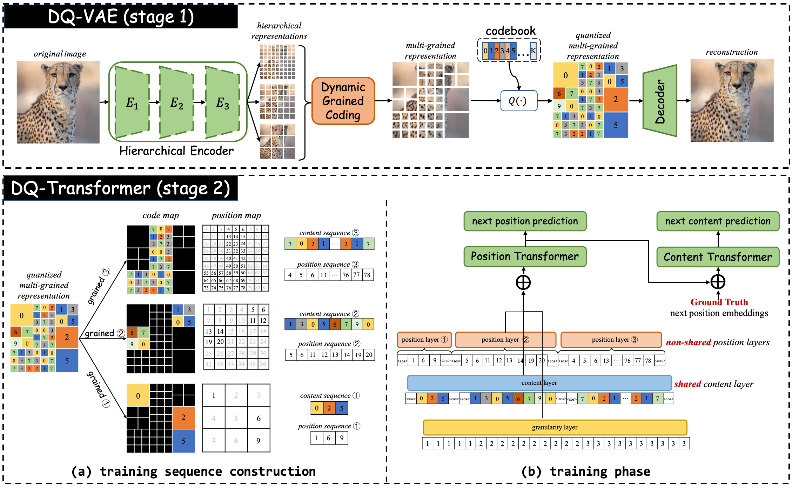
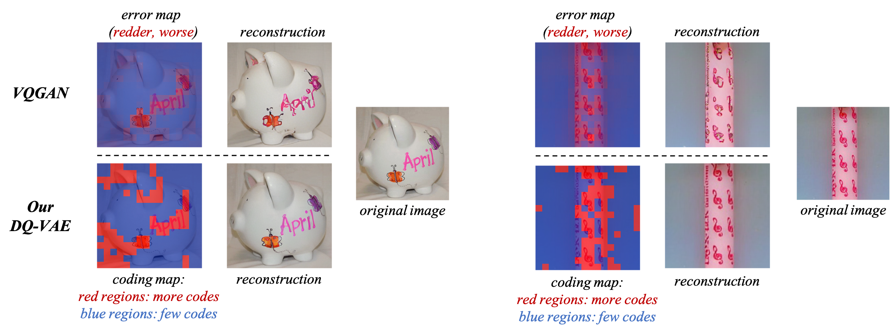

# DynamicVectorQuantization (CVPR 2023 highlight) (working in progress)

Offical PyTorch implementation of our CVPR 2023 highlight paper "[Towards Accurate Image Coding: Improved Autoregressive Image Generation with Dynamic Vector Quantization](https://openaccess.thecvf.com/content/CVPR2023/papers/Huang_Towards_Accurate_Image_Coding_Improved_Autoregressive_Image_Generation_With_Dynamic_CVPR_2023_paper.pdf)".

**TL;DR** For vector-quantization (VQ) based autoregressive image generation, we propose a novel *variable-length* coding to replace existing *fixed-length* coding, which brings an accurate & compact code representation for images and a natural *coarse-to-fine* autoregressive generation order. 

Our framework includes: (1) DynamicQuantization VAE (DQ-VAE) which encodes image regions into variable-length codes based on their information densities. (2) DQ-Transformer which thereby generates images autoregressively from coarse-grained (smooth regions with fewer codes) to fine-grained (details regions with
more codes) by modeling the position and content of codes in each granularity alternately, through a novel stackedtransformer architecture and shared-content, non-shared position input layers designs.




# Requirements and Installation
Please run the following command to install the necessary dependencies.

```
conda env create -f environment.yml
```

# Data Preparation
Prepare dataset as follows, then change the corresponding datapath in `data/default.py`.

## ImageNet
Prepare ImageNet dataset structure as follows:

```
${Your Data Root Path}/ImageNet/
├── train
│   ├── n01440764
│   |   |── n01440764_10026.JPEG
│   |   |── n01440764_10027.JPEG
│   |   |── ...
│   ├── n01443537
│   |   |── n01443537_2.JPEG
│   |   |── n01443537_16.JPEG
│   |   |── ...
│   ├── ...
├── val
│   ├── n01440764
│   |   |── ILSVRC2012_val_00000293.JPEG
│   |   |── ILSVRC2012_val_00002138.JPEG
│   |   |── ...
│   ├── n01443537
│   |   |── ILSVRC2012_val_00000236.JPEG
│   |   |── ILSVRC2012_val_00000262.JPEG
│   |   |── ...
│   ├── ...
├── imagenet_idx_to_synset.yml
├── synset_human.txt
```

## FFHQ
The FFHQ dataset could be obtained from the [FFHQ repository](https://github.com/NVlabs/ffhq-dataset). Then prepare the dataset structure as follows:
```
${Your Data Root Path}/FFHQ/
├── assets
│   ├── ffhqtrain.txt
│   ├── ffhqvalidation.txt
├── FFHQ
│   ├── 00000.png
│   ├── 00001.png
```

# Training of DQVAE
## Training DQVAE with dual granularities (downsampling factor of F=16 and F=8)
```
CUDA_VISIBLE_DEVICES=0,1,2,3,4,5,6,7 python train.py --gpus -1 --base configs/stage1/dqvae-dual-r-05_imagenet.yml --max_epochs 50
```
The target ratio for the finer granularity (F=8) could be set in `model.params.lossconfig.params.budget_loss_config.params.target_ratio`.

## Training DQVAE with triple granularities (downsampling factor of F=32, F=16, F=8)
```
CUDA_VISIBLE_DEVICES=0,1,2,3,4,5,6,7 python train.py --gpus -1 --base configs/stage1/dqvae-triple-r-03-03_imagenet.yml --max_epochs 50
```
The target ratio for the finest granularity (F=8) could be set in `model.params.lossconfig.params.budget_loss_config.params.target_fine_ratio`. The target ratio for the median granularity (F=16) could be set in `model.params.lossconfig.params.budget_loss_config.params.target_median_ratio`.

## *A Better Version of DQVAE*
Here we provide a better version of DQVAE compare with the one we proposed in the paper, which leads to much stable training results and also slight better reconstruction quality. To be specific, we assign the granularity of each region directly according to their image entropy instead of the features extracted from the encoder.

```
CUDA_VISIBLE_DEVICES=0,1,2,3,4,5,6,7 python train.py --gpus -1 --base configs/stage1/dqvae-entropy-dual-r05_imagenet.yml --max_epochs 50
```
The target ratio for the finer granularity (F=8) could be set in `model.params.encoderconfig.params.router_config.params.fine_grain_ratito`. The distribution of image entropy is pre-calculated in `scripts/tools/thresholds/entropy_thresholds_imagenet_train_patch-16.json`.

## Visualization of Variable-length Coding


# Training of DQ-Transformer

## Unconditional Generation

## Class-conditional Generation